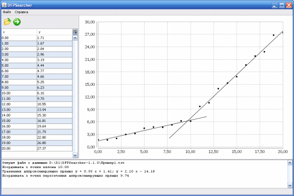

**DFPSearcher**

Dependence Fracture Point Searcher

Search for fracture point of dependency that consists of two linear sections. Calculation of equations of straight lines approximating linear sections of the dependence. Calculation of the abscissa of the intersection point of approximating lines.

